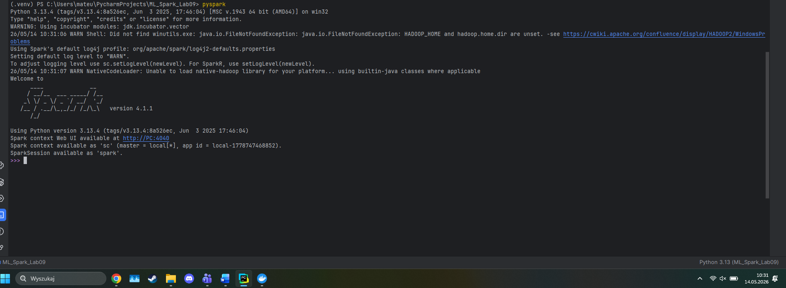
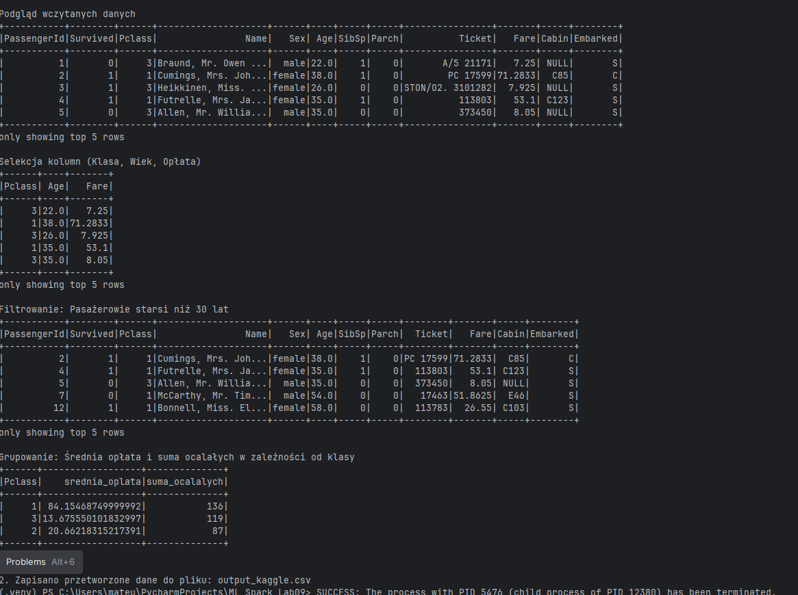
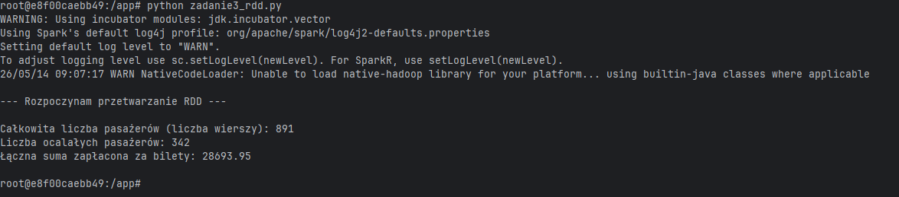

# Laboratorium 09 - Wprowadzenie do Apache Spark i PySpark

## Cel ćwiczenia
Celem laboratorium było poznanie podstaw Apache Spark oraz wykorzystanie biblioteki PySpark do przetwarzania danych. 

# Zadanie 1: Uruchomienie lokalnej instancji Apache Spark

Zainstalowano bibliotekę `pyspark` w środowisku Python oraz skonfigurowano zmienne środowiskowe.

# Zadanie 2: Podstawowe operacje na DataFrame w PySpark

Do ćwiczenia wykorzystano zbiór danych Titanic pobrany z platformy Kaggle. Wykonano:

1. Wczytanie pliku `titanic.csv`,
2. Wyświetlenie schematu danych i przykładowych rekordów,
3. Selekcję wybranych kolumn,
4. Filtrowanie pasażerów powyżej 30 lat,
5. Obliczenie średniej ceny biletu i liczby ocalałych dla każdej klasy pasażerskiej,
6. Zapis wyników do pliku CSV.

# Zadanie 3: Praca z RDD w PySpark

W ostatnim zadaniu wykorzystano RDD. Dane zostały wczytane do pamięci i przekazane do Sparka za pomocą `sc.parallelize()`.

Wykonano:

- mapowanie danych,
- filtrowanie ocalałych pasażerów,
- obliczenie łącznej wartości biletów przy użyciu funkcji `reduce()`.

# Wnioski

Ćwiczenie pozwoliło poznać podstawy pracy z Apache Spark i PySpark. DataFrame okazał się wygodniejszy i prostszy w użyciu przy analizie danych, natomiast RDD pozwoliło lepiej zrozumieć sposób działania przetwarzania rozproszonego. Dodatkowo ćwiczenie pokazało, że konfiguracja Sparka w systemie Windows może wymagać dodatkowych ustawień środowiska.